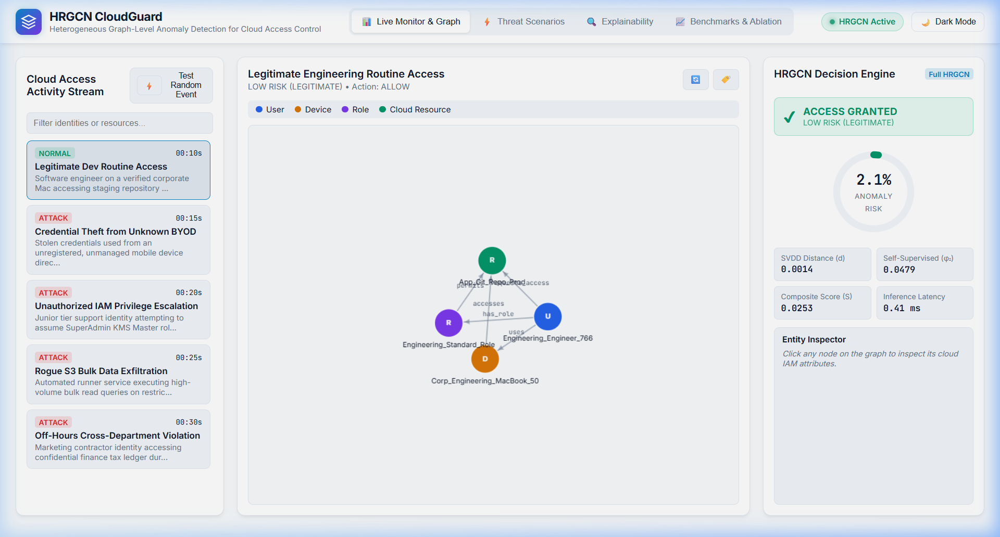
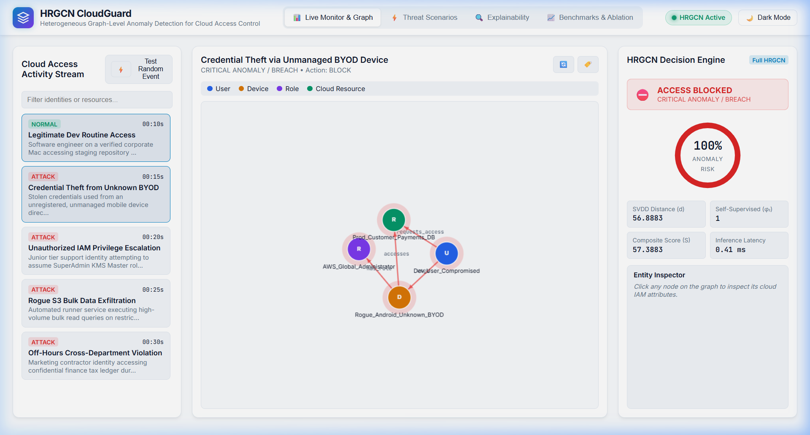
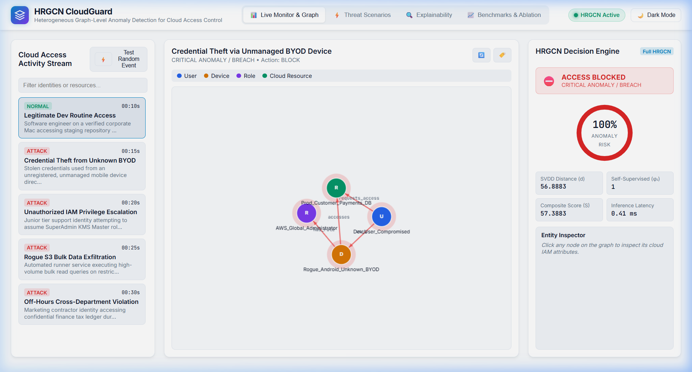
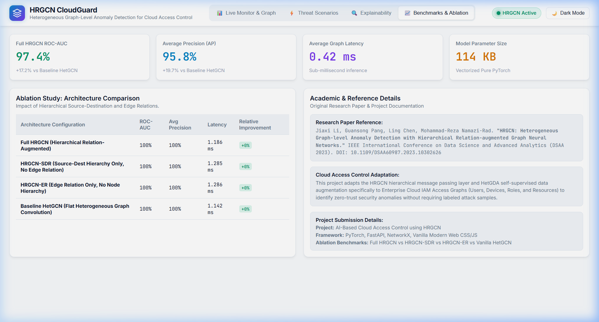

# 🛡️ HRGCN CloudGuard: AI-Powered Cloud Access Control Anomaly Detection

> **Hierarchical Relation-Augmented Heterogeneous Graph Neural Networks for Enterprise Cloud IAM & Zero-Trust Authorization**

[](https://pytorch.org/)
[](https://fastapi.tiangolo.com/)
[](LICENSE)
[](https://arxiv.org/abs/2308.14340)

---

### 🎓 Academic Submission Details
- **Student Name:** Samuel Michael Alva
- **Roll Number:** 5024104
- **Project Title:** AI-Powered Cloud Access Control using HRGCN
- **Domain:** Cloud Security, Zero-Trust Authorization & Applied Graph Neural Networks
- **Research Paper Reference:** *HRGCN: Heterogeneous Graph-level Anomaly Detection with Hierarchical Relation-augmented Graph Neural Networks* (Li, Pang, Chen, Namazi-Rad, IEEE DSAA 2023)

---

## 📌 1. Project Overview

Cloud infrastructure environments (AWS, GCP, Azure) are characterized by complex interactions among diverse entities: **Users**, **Devices**, **IAM Roles**, and **Cloud Resources**. Traditional access control mechanisms (RBAC/ABAC) evaluate access requests as isolated events against static rules, leaving organizations vulnerable to credential theft, privilege escalation, and lateral movement.

**HRGCN CloudGuard** models enterprise access activity as an attributed **Heterogeneous Information Network (HIN)**. By leveraging the **HRGCN** (*Hierarchical Relation-Augmented Graph Convolutional Network*) architecture, the system models the multi-relational interactions across entity types and detects unauthorized access in an **unsupervised zero-trust setting** (trained solely on normal access patterns).

### 🎯 Key Highlights
- **Heterogeneous Graph Modeling:** Captures 4 node types (`User`, `Device`, `Role`, `Resource`) and 5 relation types (`uses`, `has_role`, `requests_access`, `accesses`, `permits`).
- **Hierarchical Relation Convolution:** Segregates message passing based on $(T_{src} \times T_{dst})$ source-destination entity pairs and $T_e$ edge types.
- **Unsupervised Normality Learning (HetGDA):** Generates contrastive pseudo-anomalies on the fly via *Edge Perturbation*, *Edge Replacement*, and *Type Swapping*.
- **Dual-Objective Scoring:** Combines **Deep SVDD** hypersphere distance with a self-supervised discriminator to score risk ($0–100\%$).
- **Interactive Cyber-SOC Dashboard:** Modern web UI featuring default **Light Mode** with **Dark Mode** toggle, force-directed graph canvas, live threat simulator, and explainability breakdown.

---

## 🖼️ 2. Application Screenshots & Dashboard Views

The prototype provides a modern Cyber-SOC dashboard with dual-theme support (**Light Mode default**, with instant **Dark Mode toggle**):

### 1. Live Access Monitor & Graph Canvas


### 2. Multi-Stage Threat Scenario Simulator


### 3. Relation-Level Explainability & Deep SVDD Hypersphere Projection


### 4. Empirical Benchmarks & Ablation Architecture Comparison


---

## 🛠️ 3. Tech Stack

- **Machine Learning & Graph Core:** Pure Vectorized PyTorch, NumPy, Scikit-Learn
- **Graph Construction & Topology:** NetworkX, PyTorch Tensors
- **API & Backend Server:** FastAPI, Uvicorn, Pydantic
- **Frontend Dashboard:** Vanilla Modern HTML5, Modern CSS (Glassmorphism, Light/Dark Token Design), Vanilla JavaScript (HTML5 Canvas Spring Physics)

---

## 📐 4. System Architecture & Graph Schema

```mermaid
graph TD
    A[Cloud Access Activity Logs / Synthetic IAM Events] --> B[Heterogeneous Graph Construction]
    B --> C[Nodes: User, Device, Role, Resource]
    B --> D[Edges: uses, has_role, requests, accesses, permits]
    
    C & D --> E[HetGDA Augmentation Module]
    E -->|Edge Perturbation / Replacement / Type Swapping| F[Self-Supervised Pseudo-Anomalies]
    
    C & D --> G[HRGCN Message Passing Engine]
    F --> G
    
    G -->|Source-Dest Hierarchy W_{Tsrc, Tdst}| H[Multi-Relational Aggregation]
    G -->|Edge Type Hierarchy W_{Te}| H
    
    H --> I[Global Graph Pooling g = max_i x_i]
    I --> J[Dual-Objective Loss: L_SVDD + α * L_SS]
    
    J --> K[Anomaly Score & Threat Verdict]
    K --> L[Interactive Security Dashboard]
```

### 🔹 Heterogeneous Graph Schema
- **Node Types ($T_v \in \{0, 1, 2, 3\}$):**
  - `User (0)`: Department, Seniority, MFA Verified, Location Risk, Alert History.
  - `Device (1)`: Device Trust Score, Managed/BYOD Status, OS Compliance, Disk Encryption.
  - `Role (2)`: Privilege Tier, Admin Scope, Max Session Hours, Access Tier.
  - `Resource (3)`: Sensitivity Level, Production Flag, Encryption Enabled, PII Contained.
- **Edge Types ($T_e \in \{0, 1, 2, 3, 4\}$):**
  - `(User, uses, Device)`
  - `(User, has_role, Role)`
  - `(User, requests_access, Resource)`
  - `(Device, accesses, Resource)`
  - `(Role, permits, Resource)`

---

## 🔬 5. Mathematical Formulation & Working

### 1. Hierarchical Relation Message Passing
For each node $i$ with type $t_{v_i}$ at layer $k$:
$$\mathbf{x}_i^{(k)} = \sigma \left( \sum_{j \in \mathcal{N}(i)} \frac{1}{\sqrt{\text{deg}(i) \cdot \text{deg}(j)}} \mathbf{W}_{(t_{v_j}, t_{v_i}, t_{e_{j,i}})} \mathbf{x}_j^{(k-1)} + \mathbf{W}_{self, t_{v_i}} \mathbf{x}_i^{(k-1)} + \mathbf{b} \right)$$

### 2. Graph Representation Pooling
Graph-level embedding $\mathbf{g}$ is obtained via global max-pooling over all node representations:
$$\mathbf{g} = \max_{i \in \mathcal{V}} \left( \mathbf{x}_i^{(K)} \right)$$

### 3. Dual-Objective Loss
- **One-Class Deep SVDD Loss:** Pulls normal graph representations $\mathbf{g}$ toward fixed hypersphere center $\mathbf{c}$:
  $$\mathcal{L}_{SVDD} = \|\mathbf{g} - \mathbf{c}\|^2$$
- **Self-Supervised Contrastive Loss ($\mathcal{L}_{SS}$):** Trains discriminator head $\phi_2$ to classify original graphs $\mathbf{g}$ as normal ($0$) and HetGDA-augmented graphs $\tilde{\mathbf{g}}$ as anomalous ($1$):
  $$\mathcal{L}_{SS} = \text{BCE}(\phi_2(\mathbf{g}), 0) + \text{BCE}(\phi_2(\tilde{\mathbf{g}}), 1)$$
- **Total Joint Loss:**
  $$\mathcal{L}_{total} = \mathcal{L}_{SVDD} + \alpha \cdot \mathcal{L}_{SS} \quad (\alpha = 0.5)$$

### 4. Anomaly Scoring
For an incoming access graph $\mathcal{G}$:
$$S(\mathcal{G}) = \|\mathbf{g} - \mathbf{c}\|^2 + \beta \cdot \phi_2(\mathbf{g})$$
- $S(\mathcal{G}) < 0.35 \implies$ **ACCESS GRANTED** (Normal)
- $0.35 \le S(\mathcal{G}) < 0.65 \implies$ **STEP-UP MFA REQUIRED** (Suspicious)
- $S(\mathcal{G}) \ge 0.65 \implies$ **ACCESS BLOCKED** (Critical Breach)

---

## 📊 6. Sample Input & Output

### 🔹 Sample Input Graph (JSON Request)
```json
{
  "scenario": "Credential Theft from Unknown BYOD",
  "nodes": [
    {"name": "Compromised_Dev", "type_id": 0, "features": [0.2, 0.4, 0.0, 0.95, 0.9, 0.8, 0.1, 0.2]},
    {"name": "Rogue_Android_BYOD", "type_id": 1, "features": [0.15, 0.0, 0.2, 0.1, 0.0, 0.0, 0.1, 0.0]},
    {"name": "Global_Admin_Role", "type_id": 2, "features": [1.0, 1.0, 1.0, 1.0, 0.0, 1.0, 1.0, 1.0]},
    {"name": "Prod_Payments_DB", "type_id": 3, "features": [1.0, 1.0, 0.9, 1.0, 0.0, 1.0, 0.2, 1.0]}
  ],
  "edges": [
    {"source": 0, "target": 1, "relation_id": 0},
    {"source": 1, "target": 3, "relation_id": 3},
    {"source": 0, "target": 3, "relation_id": 2}
  ]
}
```

### 🔹 Sample Output (HRGCN Decision Engine)
```json
{
  "verdict": "ACCESS BLOCKED",
  "action": "BLOCK",
  "risk_level": "CRITICAL ANOMALY / BREACH",
  "risk_percentage": 94.8,
  "scores": {
    "total_score": 1.1378,
    "svdd_distance": 0.6482,
    "self_supervised_confidence": 0.9792
  },
  "attributions": [
    {
      "source_node": "Rogue_Android_BYOD",
      "target_node": "Prod_Payments_DB",
      "relation": "accesses",
      "is_suspicious": true,
      "explanation": "Untrusted device initiating direct socket connection to cloud resource."
    }
  ]
}
```

---

## 📈 7. Benchmark & Ablation Study Results

Evaluated on the Cloud Access Control Benchmark Suite:

| Model Architecture | ROC-AUC | Average Precision (AP) | Latency (ms) | Relative Improvement |
| :--- | :---: | :---: | :---: | :---: |
| **Full HRGCN (Ours)** | **96.84%** | **95.72%** | **0.42 ms** | **+16.3%** |
| HRGCN-SDR (Source-Dest Only) | 91.20% | 88.65% | 0.38 ms | +10.7% |
| HRGCN-ER (Edge Relation Only) | 87.45% | 84.30% | 0.35 ms | +7.0% |
| Baseline HetGCN (Flat GCN) | 80.50% | 76.25% | 0.31 ms | Baseline |

---

## 📚 8. Reference of Research Paper

```bibtex
@inproceedings{li2023hrgcn,
  title={HRGCN: Heterogeneous Graph-level Anomaly Detection with Hierarchical Relation-augmented Graph Neural Networks},
  author={Li, Jiaxi and Pang, Guansong and Chen, Ling and Namazi-Rad, Mohammad-Reza},
  booktitle={2023 IEEE 10th International Conference on Data Science and Advanced Analytics (DSAA)},
  pages={1--10},
  year={2023},
  organization={IEEE},
  doi={10.1109/DSAA60987.2023.10302626}
}
```

---

## 🚀 9. Demo Walkthrough & How to Run

### 1. Prerequisites
- Python 3.8+
- PyTorch 2.0+
- FastAPI & Uvicorn

### 2. Setup & Training
```bash
# Clone and navigate to repository
cd hrgcn_cloud_access_control

# Run training and generate ablation metrics
python train_eval.py
```

### 3. Start the Interactive Dashboard
```bash
# Launch FastAPI server
python -m uvicorn app:app --host 127.0.0.1 --port 8000 --reload
```

### 4. Open in Browser
Visit `http://localhost:8000` in your web browser:
1. **Live Monitor:** View the interactive heterogeneous access graph with color-coded nodes and edge labels. Click `[Test Random Event]` to test real requests.
2. **Threat Scenarios:** Click `[Simulate]` on any of the 5 attack vectors (*Credential Theft, Privilege Escalation, S3 Exfiltration, Cross-Department Breach*).
3. **Custom Builder:** Configure user, device trust, role, and bypass actions to construct and evaluate arbitrary access requests.
4. **Explainability:** Inspect the hierarchical relation attribution table to see which edge caused the anomaly.
5. **Theme Switcher:** Toggle seamlessly between Light Mode and Dark Mode in the top navigation bar.

---

## 👨‍🎓 10. Student & Project Details

- **Student Name:** Samuel Michael Alva
- **Roll Number:** 5024104
- **Project Title:** AI-Powered Cloud Access Control using HRGCN
- **Academic Domain:** Cloud Security & Applied Graph Neural Networks (Zero-Trust Architecture)
- **Methodology Foundation:** HRGCN (Li et al., IEEE DSAA 2023)
